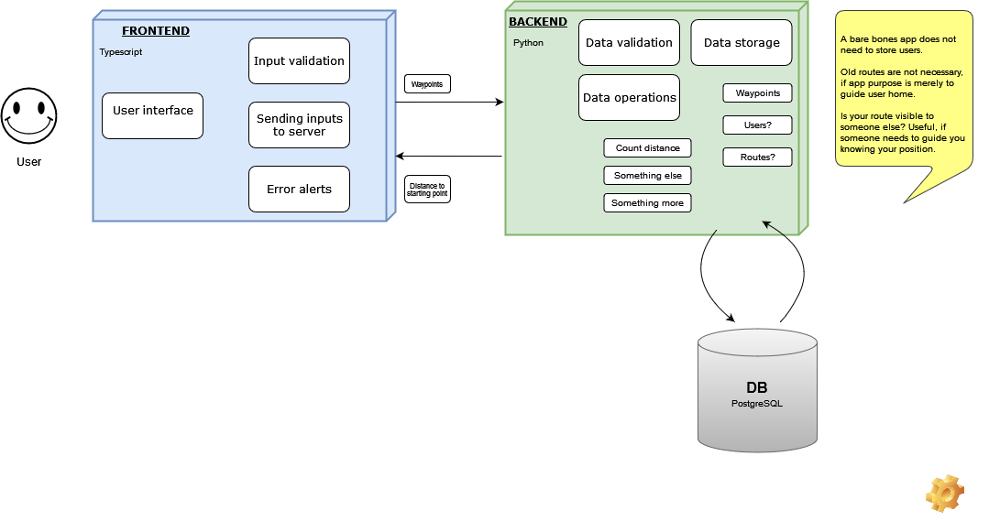

# Project documentation

Contains general documentation about the Berry picker tracker app.

- [Coding practices](coding_practices.md)
- [Definition of Done](definition_of_done.md)
- [Used technologies](used_technologies.md)
- [Front-end repository](https://github.com/hy-ohtu-syksy-22-bpt/berry-picker-tracker)
- [Back-end repository](https://github.com/hy-ohtu-syksy-22-bpt/berry-picker-tracker-server)
- [Implementation document - frontend](implementation_document.md)
- [Building instructions - frontend](frontend_building_instructions.md)
- [Database schema](bpt_schema.png)
- [Instructions to connect local database](db_locally_instructions.md)
- [Working hours record](https://helsinkifi-my.sharepoint.com/:x:/g/personal/xnoxno_ad_helsinki_fi/ETDD0FY5rd1An2Se0MyZSY4BvD3RpfLrcq2aFHH6xXRbMQ?e=HGQdGf)

### Licenses

- [Front end licenses](https://github.com/hy-ohtu-syksy-22-bpt/berry-picker-tracker/tree/main/licenses)
- [Back end licenses](https://github.com/hy-ohtu-syksy-22-bpt/berry-picker-tracker-server/tree/main/licenses)

### Privacy Policy

- [Privacy Policy](privacy_policies.md)

### Example user interface

### Architecture

