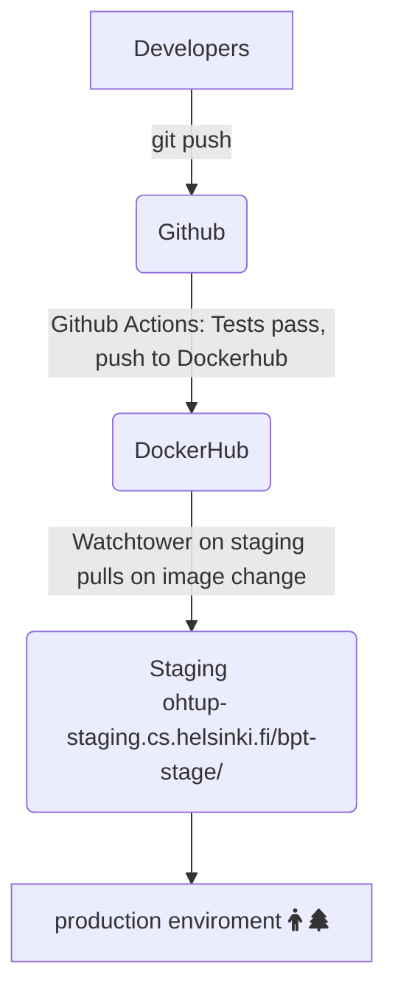

# CI/CD pipeline

<!--
See the official documentation for syntax
https://mermaid.js.org
-->

The following graph demonstrates the CI/CD pipeline of the application.

```mermaid
graph TD
    A[Developers] -->|git push| B(Github)
    B -->|Github Actions: Tests pass, push to Dockerhub| C(DockerHub)
    C --> |Watchtower on staging pulls on image change| D(Staging \n ohtup-staging.cs.helsinki.fi/bpt-stage/)
    D --> F[production enviroment fa:fa-person fa:fa-tree]
```
