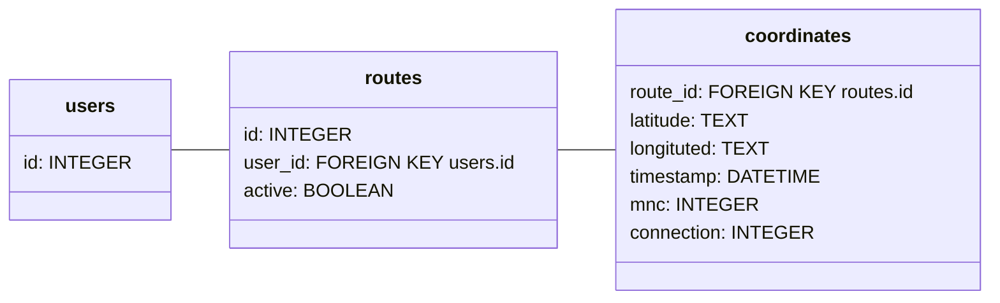
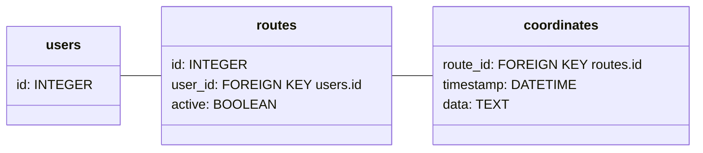

# Database

The project uses [PostgreSQL](https://www.postgresql.org/) for its database but currently also uses SQLite for backend tests.

## Original schema

Note: mnc is the identifying [mobile network code](<https://en.wikipedia.org/wiki/Mobile_network_codes_in_ITU_region_2xx_(Europe)#Finland_%E2%80%93_FI>) of the [operator](https://en.wikipedia.org/wiki/List_of_mobile_network_operators_of_Europe#Finland).

## Current schema

Longitude and latitude were changed to TEXT format to enable encryption.

## What the schema should be refactored to

This is what the database should be refactored to for full encryption implementation. The _data_ column contains the longituted, latitude, mnc and connection information concatenated and encrypted into a single string.

