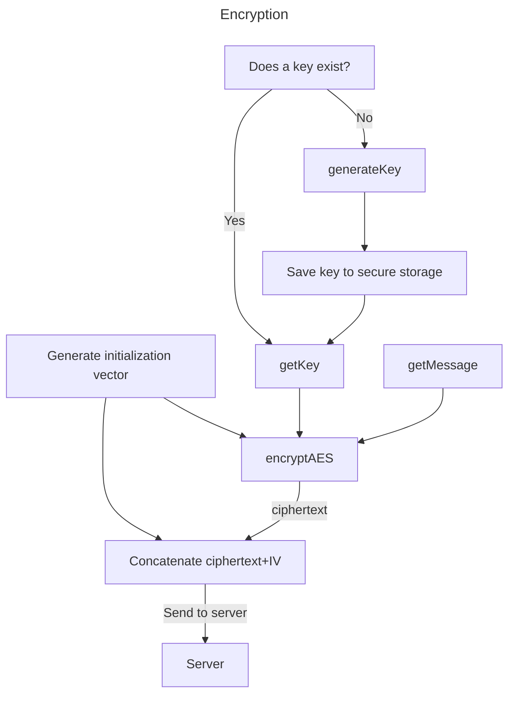
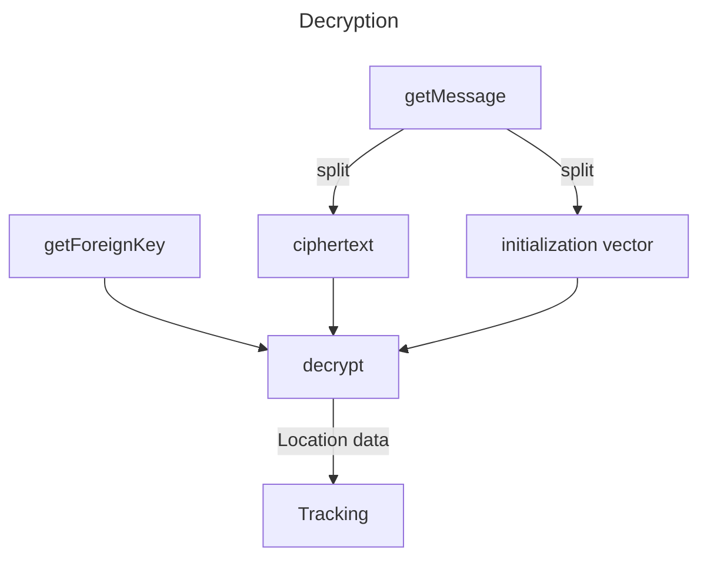
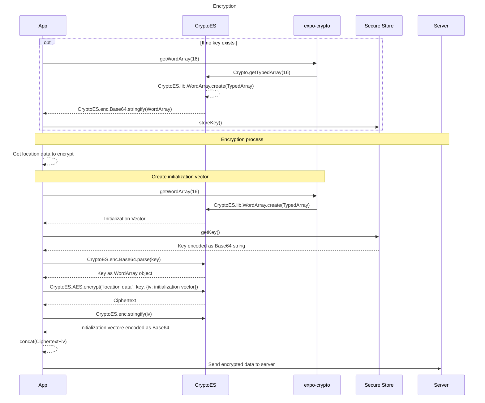
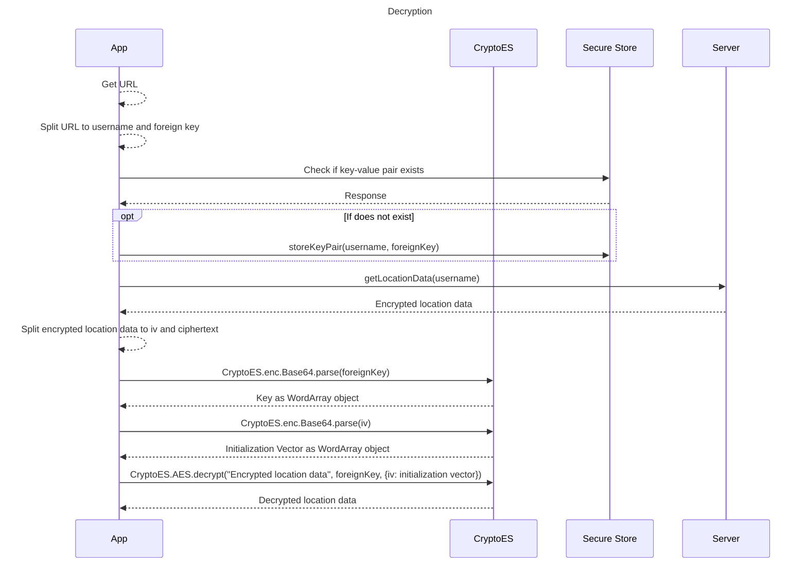

# Encryption

Berry Picker Tracker uses 128-bit AES-CBC encryption. Keys are stored using native secure storage solutions of Android and iOS.

## Short Glossary

- **Initialization vector, iv**
  - A unique binary sequence used to ensure that the output from the encryption method is different every time even when encrypting the same plaintext data with the same key. A new one is created for every encryption.
- **Key, Foreign Key**
  - The string of data used to encrypt and decrypt data. Keys are username specific and are stored as username-key key-value pairs. In this documentation, foreign key refers to the personal keys of the other users you are tracking.
- **WordArray**
  - A custom class of the CryptoES library. See [CryptoES](#cryptoes) for details.

## How It Works?

### expo-crypto

Both keys and single-use initialization vectors (IV) are generated using the [expo-crypto](https://docs.expo.dev/versions/latest/sdk/crypto/) API because its number generation uses the native generators of Android and iOS.

```typescript
Crypto.getRandomBytes(16)
```

This returns a JavaScript [Uint8Array](https://developer.mozilla.org/en-US/docs/Web/JavaScript/Reference/Global_Objects/Uint8Array) object, a type of [TypeArray](https://developer.mozilla.org/en-US/docs/Web/JavaScript/Reference/Global_Objects/TypedArray). Used for both key and initialization vector creation. The length is 16, because 16-bytes = 128-bit.

### expo-secure-store

An [API](https://docs.expo.dev/versions/v48.0.0/sdk/securestore/) to store key-value pairs locally on the device in a secure manner. The underlying native features are [Android Keystore](https://developer.android.com/training/articles/keystore) and iOS [Keychain Services](https://developer.apple.com/documentation/security/keychain_services). Keys **must** be stored in String format.

### CryptoES

A TypeScript cryptography library using the same API as [CryptoJS](https://github.com/brix/crypto-js).

```typescript
CryptoES.lib.WordArray.create(TypedArray)
```

This method converts the given TypedArray (for example, the Uint8Array returned by expo-crypto) into a WordArray object. This is done because the CryptoES library only uses either Strings or WordArrays for encryption and decryption.

WordArray is a custom class of CryptoES, it represents an array of 32-bit words (= 32-bit unsigned integers). The class is used for more optimal performance since modern processors use either 32- or 64-bit word lengths. For more details, see [this StackOverflow answer](https://stackoverflow.com/a/58525779).

```typescript
CryptoES.enc.Base64.stringify(WordArray)
CryptoES.enc.Base64.parse(string)
```

These methods are used to convert a WordArray object to String and vice versa. The `stringify()`method encodes the bits contained in the WordArray to string using the given [character encoding](https://en.wikipedia.org/wiki/Character_encoding) model, in this case Base64. In reverse, the `parse()` method converts a string to a WordArray object.

```typescript
CryptoES.AES.encrypt("plaintext data", key, {iv: iv})
CryptoES.AES.decrypt("ciphertext", key, {iv: iv})
```

These are the actual encryption and decryption methods. For more info about the Advanced Encryption Standard (AES), click [here](https://en.wikipedia.org/wiki/Advanced_Encryption_Standard) and for more about Cipher block chaingin (CBC), click [here](<https://en.wikipedia.org/wiki/Block_cipher_mode_of_operation#Cipher_block_chaining_(CBC)>).

## Flowcharts





## Sequence Diagrams




