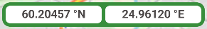
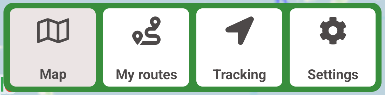
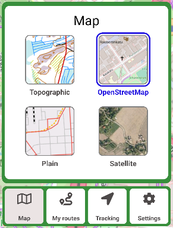
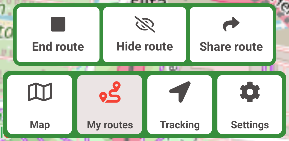
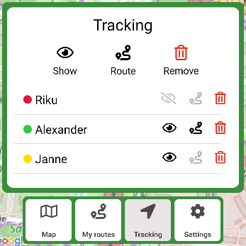
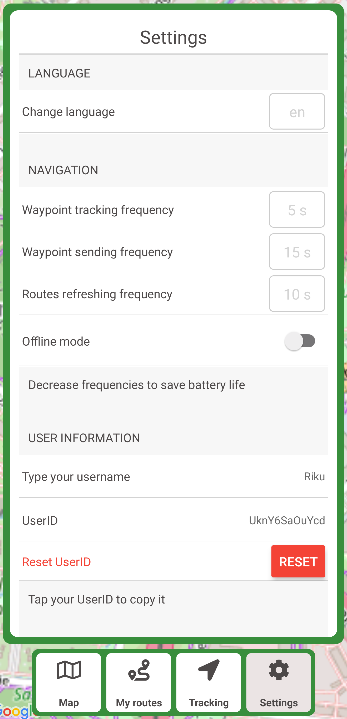

# Features

This document goes over the features provided in the application's user interface. The mobile application consists of one main *view* or *screen*. In the source code, this is simply known as the *Screen*. On top of the screen, various *menus* can be opened. The main map view contains all the main functionality of the application. It consists of a coordinate bar, a background map and various navigation or functionality buttons.

## Coordinate Bar

The coordinate bar displays the user's current location using the [Geographic coordinate system](https://en.wikipedia.org/wiki/Geographic_coordinate_system). The coordinate bar consists of two separate values: the **latitude**, i.e. the *North-South* position and the **longitude**, i.e. the *East-West* position. Both values are rounded to five decimals.

For example, a person standing at the [Senate Square](https://en.wikipedia.org/wiki/Senate_Square,_Helsinki) in Helsinki would see their location displayed as `60.16948 °N, 24.95228 °E`. Or a person located in the Exactum building at Kumpula Campus would have the coordinates `60.20457 °N, 24.96120 °E`.

## Map

The most relevant part of the application is the map. The map takes almost all space on the screen. By default, the map uses map tiles provided by the [National Land Survey of Finland](https://www.maanmittauslaitos.fi/en).

On the map, the user can see their location as a light blue dot with a white outline. While recording a route or tracking other users, various locations and routes will be overlaid on the map in different colors.

## Navigation Bar

At the bottom of the screen, a *navigation bar* is displayed. This bar can be used to toggle between various *menus*. The currently opened menu button has a slightly gray colored background.

## Menus

### Map Menu

The first menu is the *map menu*. The menu can be opened by tapping the navigation button with the text `Map`. The map menu offers the choice between four different background maps. The map can be selected by tapping the thumbnail or the text of the map. The currently selected map has a blue border and the text is highlighted in blue.

The map options are:
- **Topographic**: Provided by the National Land Survey of Finland. A good option for rural or forested areas. Perfect for berry picking in the Finnish forests!
- **OpenStreetMap**: Provided by [OpenStreetMap](https://www.openstreetmap.org). Might be a more useful option when moving in a more urban setting.
- **Plain**: Provided by the NLS. Displays a plain map with no extra details.
- **Satellite**: Provided by the NSL. Displays an aerial image.

### My Routes

Tapping the `My Routes` navigation button brings up route controls. Tapping `Start route` will start recording a new route and `End route` will stop recording. Tapping `Hide route` will hide the current route being recorded and `Share route` opens a link to be copied and shared with other users. When a recording is in progress, the icon of the button will turn red.

### Tracking Menu

Other users can be tracked by asking them to share their link via a messaging application, e.g. WhatsApp or Telegram. Tracked users will show up in the the Tracking menu, which can be opened by tapping the `Tracking` button. The tracking menu contains a list of tracked users and their names and corresponding colors. Each user has three buttons associated with them:

- The *eye* button: shows or hides the user's current location
- The *route* button: shows or hids the user's current route
- The *trash can* button: deletes a user from the tracking menu

The tracking menu also contains master toggle buttons to perform the aforementioned operations on all users on the list. Tapping the `Remove` button will always ask for confirmation before performing any deletion operations.

### Settings Menu

The settings menu can be opened by tapping the `Settings` button in the navigation bar. All relevant application settings can be found here.
